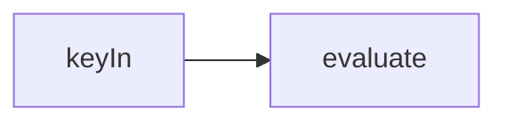
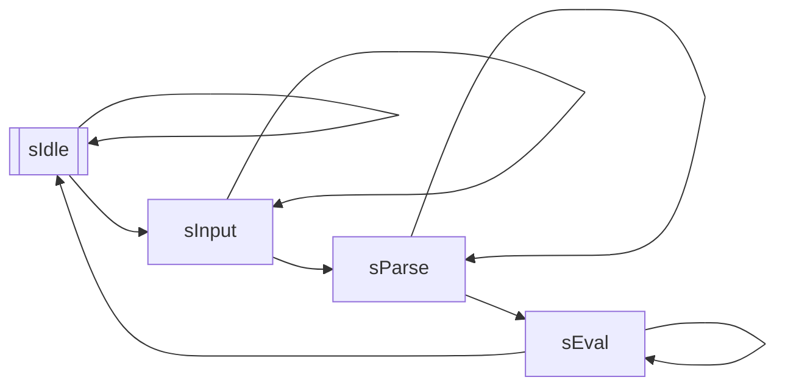
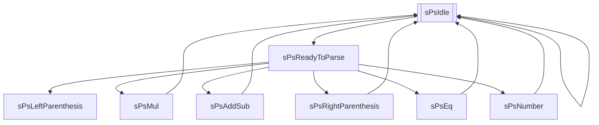
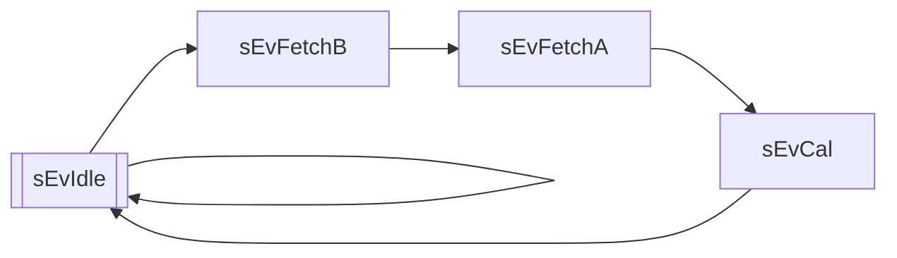

NTHU_109062274_楊子慶  ACAL 2024 Spring Lab 5 HW Submission
===

###### tags: `AIAS Spring 2024`

## Before starting our journey

Travelers always do their best before the departure of their adventures, so as what programmers favor before designing and implementing programs. When we see the program template isn’t well-prepared, we may do something like the first git commit of mine:

```txt
Re-initialize the whole project

* Rename all the project/files/modules/variables to follow the style that recommended by Chisel
* Format all the source codes by applying style that configured in .scalafmt.conf
* Update run script introduced and implemented in lab04 with more flexibility and functions
```

Nice, let's start our journey ;)

## Hw5-1 TrafficLight with Pedestrian button

### 5-1 Spec

#### Traffic light encoding

|meaning/name|`off`|`red`|`yellow`|`green`|
|:-:|:-:|:-:|:-:|:-:|
|value|0|1|2|3|

#### State encoding

|meaning|idle|h: g<br>v: r|h: y<br>v: r|h: r<br>v: g|h: r<br>v: y|Time for<br>pedestrian|
|:-:|:-:|:-:|:-:|:-:|:-:|:-:|
|name|`sIdle`|`sHgVr`|`sHyVr`|`sHrVg`|`sHrVy`|`sPg`|
|value|0|1|2|3|4|5|

### `AdvanceCounter`

In lab 5-1, we can see there is a simple template of counter implementation. Since we need a counter with quite complicated function in `TrafficLightPed`, I then first design the `AdvanceCounter` that can deal with so many complicated jobs.

This module aim to be a super powerful counter that can:

* Customize
    * counting range: `from`, `to`
* Control on demand (runtime)
    * `reset` value to initial value according to counting direction
    * `enable` counting
    * `revert` counting direction (up/down count)
    * `inject` value when `toInject` is enabled

and produce value with <font color=orange>**width auto-detected**</font>.

One can design the IO interface as:

```scala
/**
 * `revert` (bool): `0` mean up-count and `1` means
 * count according to down-count
 */
class AdvanceCounter(from: Int = 0, to: Int = 9)
    extends Module {
  /**
   * Get width of given integer
   */
  def getWidth(n: Int) = n.U.getWidth
  // Width of this counter
  val cntWidth =
    Math.max(getWidth(from), getWidth(to))

  val io = IO(new Bundle {
    // counting direction
    val reset    = Input(Bool())
    val enable   = Input(Bool())
    val revert   = Input(Bool())
    val toInject = Input(Bool())
    val inject   = Input(UInt(cntWidth.W))
    // output width determined by SevenSeg
    val value = Output(UInt(cntWidth.W))
  })

  ...
}
```

With such a counter, we're well-prepared to design the structure of `TrafficLoghtPed`.

#### Implementation

We can take the advantage of MUXs to select correct signal

```scala
class AdvanceCounter(from: Int = 0, to: Int = 9)
    extends Module {
  ...
  val initValue = Mux(~io.revert,
                      from.U(cntWidth.W),
                      to.U(cntWidth.W))

  val cntReg = RegInit(initValue)

  /**
   * Normal up-or-down count value
   */
  val normCntValue =
    Mux(
      ~io.revert,
      Mux(cntReg === to.U, from.U, cntReg + step.U),
      Mux(cntReg === from.U, to.U, cntReg - step.U)
    )

  /**
   * Next value considering value injection
   */
  val nextValue =
    Mux(io.toInject, io.inject, normCntValue)

  cntReg := Mux(io.reset,
                initValue,
                Mux(io.enable, nextValue, cntReg))
  io.value := cntReg
}
```

#### Factory

Same as what we've done in lab4, pursuing  for simpler user experience, we create a class factory as follows.

> Well, although the user is... me ;)

```scala
object AdvanceCounter {
  def apply(from: Int = 0, to: Int = 9)(
      value:    UInt,
      reset:    Bool = false.B,
      enable:   Bool = true.B,
      revert:   Bool = false.B,
      toInject: Bool = false.B,
      inject:   UInt = 0.U) = {
    val ac = Module(
      new AdvanceCounter(from = from, to = to))

    ac.io.reset    := reset
    ac.io.enable   := enable
    ac.io.revert   := revert
    ac.io.toInject := toInject
    ac.io.inject   := inject
    value          := ac.io.value

    ac
  }
}
```

Such a implementation enables us to have downward compatibility to a normal `Counter`, elegant!

Note that user doesn't need to assign all the input wires if one assigns them with <font color=red>named argument</font>, powered by `Scala` language.

As the designer as well as the user, I used it in `TrafficLightPed` as:

```scala
AdvanceCounter(0, timeRange)(
  value    = io.timer,
  revert   = true.B, // always down count
  toInject = isCntToEnd,
  inject   = inject
)
```

Elegant!

#### Testbench

To test a module too complicated to generate all possible normal and edge cases, one can utilize random test by implementing the exactly same functionality in software manners and compare the result:

```scala
class AdvanceCounterTest(counter: AdvanceCounter,
                         from: Int,
                         to: Int)
    extends PeekPokeTester(counter) {
  // Use software to simulate the same
  // logic as AdvanceCounter
  var value  = from
  var reset  = false
  var enable = true
  var revert = false

  val kinds = 5
  val norm :: flipRst :: flipEn :: flipRev :: doInject :: Nil =
    Enum(kinds).map(n => n.toInt)

  var genRnd = new Random()
  for (_ <- 0 until 1000) { // try 1000 random tests
    val op = genRnd.nextInt(kinds)
    val inject =
      genRnd.nextInt(to - from + 1) + from;

    expect(
      counter.io.value,
      value,
      s"${counter.io.value} != golden: ${value}")

    op match {
      case `norm` => {}
      case `flipRst` => {
        reset = !reset
      }
      case `flipEn` => {
        enable = !enable
      }
      case `flipRev` => {
        revert = !revert
      }
      case `doInject` => {
        poke(counter.io.toInject, true.B)
        poke(counter.io.inject, inject.U)
      }
    }

    poke(counter.io.reset, reset.B)
    poke(counter.io.enable, enable.B)
    poke(counter.io.revert, revert.B)
    if (op != doInject) {
        poke(counter.io.toInject, false.B)
    }

    value = if (reset) { if (revert) to else from }
    else {
      if (enable) {
        if (op == doInject) {
          inject
        } else {
          if (revert) {
            if (value == from) to else value - 1
          } else {
            if (value == to) from else value + 1
          }
        }
      } else {
        value
      }
    }

    step(1)
  }
}

object AdvanceCounterTest extends App {
  for (f <- 0 until 9) {
    for (t <- f + 1 until 10) {
      Driver.execute(
        args,
        () => new AdvanceCounter(f, t)) {
        counter: AdvanceCounter =>
          new AdvanceCounterTest(counter, f, t)
      }
    }
  }
}
```

We can see that we:
* Use nested loop to generate and test `AdvanceCounter`s with **different counting range**
* In each test, we generate 1000 of random operations. For each we will do one of the behaviors listed below
    * flip `reset` input
    * flip `enable` input
    * flip `revert` input
    * do value injection with random value in range of `AdvanceCounter`

We can test with

```bash
./scripts/run check Hw1.AdvanceCounterTest | grep FAIL
```

to get no output (i.e. all tests passed).

### `TrafficLightPed`

With `AdvanceCounter`, we can:

* Wire `revert` to true in order to do down count
* Prepare `inject` value and `isCntToEnd` (`toInject`) signal to setup new counter value when we've
    * Count to zero or
    * Pedestrian button is pressed
* Wire output value to `io.timer`

```scala
// in class TrafficLightPed
val io = IO(new Bundle {
  val pButton  = Input(Bool())
  val hTraffic = Output(UInt(2.W))
  val vTraffic = Output(UInt(2.W))
  val pTraffic = Output(UInt(2.W))
  val timer    = Output(UInt(5.W))
})

// State of traffic lights
val off :: red :: yellow :: green :: Nil = Enum(4)

/**
 * `s`: state, `H`: horizontal, `V`: vertical,
 * `r`: red, `y`: yellow, `g`: green, `P`:
 * pedestrian
 */
val sIdle :: sHgVr :: sHyVr :: sHrVg :: sHrVy :: sPg :: Nil =
  Enum(6)

val timeRange =
  Seq(yTime, gTime, pTime).reduce(Math.max)

println(s"timeRange is ${timeRange}")

val stateCache = RegInit(sIdle)
val inject     = Wire(UInt(5.W))
val isCntToEnd = io.timer === 0.U | io.pButton

AdvanceCounter(0, timeRange)(
  value    = io.timer,
  revert   = true.B, // always down count
  toInject = isCntToEnd,
  inject   = inject
)
```

Note that I calculate the range of timer `timeRange` in functional programming paradigm style, making the code to be understood easily.

The `timeRange` is passed to `AdvanceCounter` to generate customized module.

Then, determine sequential logic of next state:

```scala
// State register
val state = RegInit(sIdle)

/**
 * @brief
 *   Determine:
 *   - current traffic light
 *   - if count to end of current state:
 *     - Next state
 *     - Next injection value of timer
 */
state       := state
io.hTraffic := off
io.vTraffic := off
io.pTraffic := off
inject      := 0.U
stateCache  := stateCache
switch(state) {
  is(sIdle) {
    state := sHgVr
  }
  is(sHgVr) {
    io.hTraffic := green
    io.vTraffic := red
    io.pTraffic := red
    when(isCntToEnd) {
      inject := (yTime - 1).U
      state  := sHyVr
    }
  }
  is(sHyVr) {
    io.hTraffic := yellow
    io.vTraffic := red
    io.pTraffic := red
    when(isCntToEnd) {
      inject := (gTime - 1).U
      state  := sHrVg
    }
  }
  is(sHrVg) {
    io.hTraffic := red
    io.vTraffic := green
    io.pTraffic := red
    when(isCntToEnd) {
      inject := (yTime - 1).U
      state  := sHrVy
    }
  }
  is(sHrVy) {
    io.hTraffic := red
    io.vTraffic := yellow
    io.pTraffic := red
    when(isCntToEnd) {
      inject := (gTime - 1).U
      state  := sHgVr
    }
  }
  is(sPg) {
    io.hTraffic := red
    io.vTraffic := red
    io.pTraffic := green
    when(isCntToEnd) {
      ... // Will introduce later
    }
  }
}
```

When pedestrian button is pressed, we should store current state and inject timer value of pedestrian traffic light.

```scala
when(io.pButton) {
  /**
   * Cache last state and update it if needed.
   * Notice that if state is sPg, we should NOT
   * override cached old state, otherwise we can't
   * get back to origin state
   */
  when(state =/= sPg) {
    stateCache := state
  }
  state  := sPg
  inject := (pTime - 1).U
  // set what we shall do in sPg state
  io.hTraffic := red
  io.vTraffic := red
  io.pTraffic := green
}
```

Then, after we're in `sPg` state and count to the end, we should do context switch: restore the old state and inject correct value.

```scala
switch(state) {
  ...
  is(sPg) {
    ...
    when(isCntToEnd) {
      state := stateCache
      when(
        stateCache === sHgVr || stateCache === sHrVg) {
        inject := (gTime - 1).U
      }.otherwise {
        inject := (yTime - 1).U
      }
    }
  }
}
```

### Waveform

#### Normal part

Refer to [spec](#5-1-Spec), we can see that the state shifting matches what we desire.


In the second snapshot, we can see that when `pButton` is triggered at about 90 and 125 ns, the old state is prempted by `sPg` and the timer is set to `pTime - 1` as expected. At the ends of countdown of pedestrian's time, the old state is restored and timer is set correctly.


## Hw5-2 Robust Calculator

### Introduction

In Hw5-2, I only design and implement one hardware calculator: `RobustCalculator`, that can handle all the legal expressions.

Before I introduce the implementation method, we should first discuss the algorithm and methodology of hardware designation.

### Spec

As the spec we've familiared with, `RobustCalculator` should at least be able to handle the cases listed below:

* (Lab5-2-1) Integer generation: `INT=` $\rightarrow$ `INT`
* (Lab5-2-2) Basic calculation: `I1{+,-,*}I2=` $\rightarrow$ `RESULT`
* (Hw5-2-1) Negative integer generator: `(-INT)=` $\rightarrow$ `-INT`
* (Hw5-2-2) Abritrary operators: `I1[{+,-}I2[{+,-}I3...]]` $\rightarrow$ `RESULT`
* (Hw5-2-3) Operation with priority: `()` > `*` > `+,-`
* (Bonus) Enable non-parenthesized negative number, e.g.
    * `0+-50=` should output `-50`, since `-50` should be treated as a normal integer
    * `50*-50=` should output `-2500`, since `-50` should be treated as a normal integer

Also, to generalize the bonus part, I want my `RobustCalculator` be able to handle unlimited unary `+,-` following rules of multiplication, for example

* `++++++++++50=` should output `50`
* `+++-+++++++50=` should output `-50`, since there is one leading `-`
* `----50=` should output `50`, since two negative should be pairly cancelled in evaluation

Meanwhile, for the edge case of a single `=`, `RobustCalculator` should be able to output `0` just like a normal calculator, same as the edge case of `0=`.

To satisfy such a spec, let us introduce the algorithm we developed.

### Algorithm

#### Overview of classical one

As a classical CS student who has taken the Data Structure and Algorithm course, we all acquainted with the algorithm to evaluate a `+-*()` expression, that is, just like what TA introduced in lab5:

* Transfer expression from infix to postfix (using 2 stacks, `postfix` and `symStack` in my implementation)
    * Scan the input one by one
        * For numbers, throw them directly into `postfix`
        * For operators, check if the priority is greater than stack top of `symStack`
            * If not, pop stack until current operator we meet has greator priority
            * Then push current operator to `sysStack`
* Evaluate postfix expression (using one stack)
    * For each number, we push them to a new stack (in my implementation, `evaluator`)
    * For each operator on the stack top, we then pop and fetch two operands on the stack top of `evaluator`, applying the operation and put the result back into `evaluator`
    * Until the traversed the postfix expression, the only number remains in `evaluator` should be the answer

However, the algorithm doesn't support unary `+,-` operator, so we need to develope a modified version.

#### Support of unary operators

For unary operators, rather than treating unary operators in a different way, I'll prefer generalize them to become normal binary operators. If so, we can reuse the original algorithm in evaluation part.

Normally, for unary `+,-`, one can do a trick to trasfer them into binary `+,-`, that is:

$$
+x = (0+x)
$$

$$
-x = (0-x)
$$

for all $x$ expression. Such an intuitive way, right? But there comes some questions:

* How to identify the unary operators?
* For adding `(0{+.-}`, there should be not problems, but what about the ending `)`? When should we add the trailing `)`?
* Expanding the expression means that we need fatter `postfix` stack to store additional `0`

For the third question, since we don't need to expand the encode bit length of operators and also I did a trick on `postfix` to shrink the size of storing each number, this side effect should be not that critical.

For the first question, we can make use of the property of binary operation for unary operator detection. Since we'll eventually convert unary operation to binary one, the converted version should <font color=orange>**always follow the property of**</font>:

$$
\rm{Number\ of\ operators} + 1 = \rm{Number\ of\ operands}
$$

So, if we count a new element of operator that satisfy the below equation:

$$
\rm{Number\ of\ operators} = \rm{Number\ of\ operands}
$$

then we know that the new element is definitely a unary operator.

For the second question, or perhaps the more difficult one, our solution is to use a so called "level" record stored using a new stack simulating the behavior of parenthesis to detect the ending position before adding a new element.

Consider the following case:

$$
\cdots-x\cdots \rightarrow \cdots(0-x)\cdots
$$

where $x$ can be any expression, if we know the level before $x$ is $l$, then we should add additional parenthesis when we're trying to add a valid element after $x$, that is, `+-*)=`.

```python
[before]
  ...    -x  ...
[after]
  ...  (0-x) ...
(lv: l)   ^ (lv: l)
          |
          |
(inside expression x,
 maybe there exists other parenthesis,
 i.e. have level change,
 but we don't care,
 we only care about that
 when the level goes down back to l)
```

To achieve this, a stack is perhaps the best level recorder to simulate how parenthesis works.

### Modeling

As a CS student, it's hard to implement RTL directly. However, our sharpest weapon is nothing but software programming. I take the advantage of my OOP and software testing skill to make sure the implementation of the algorithm is valid.

In `test.scala.acal.lab05.Hw2.golden` package, there exists a object: `GoldenCalculator` which simulate complete the same algorithm of our target: `RobustCalculator` in the software manners.

But before we introduce the implementation of `GoldenCalculator`, we shall first take a look at the `GoldenSingleSideList` helper data structure series.

#### `GoldenSingleSideList`

Objects prefixed with `Golden` are the software implementation of that doesn't prefixed with `Golden`.

As its name indicates, this is the [ADT](https://en.wikipedia.org/wiki/Abstract_data_type) of lists with single side as input and single side as output. Appearently, stack (`GoldenStack`) and queue (`GoldenQueue`) are two instances of `GoldenSingleSideList`.

A `GoldenSingleSideList` interface should implements methods listed below:

```scala
/**
 * A list-structured data structure having single
 * side as input and single side as output.
 */
trait GoldenSingleIoList[T] {
  /**
   * @brief
   *   push the element to input side
   */
  def push(e: T): Unit
  /**
   * @brief
   *   pop the element on the output side
   */
  def pop(): T
  /**
   * @brief
   *   peek the element on the output side
   */
  def peek(): T
  /**
   * @brief
   *   check whether the list is empty
   */
  def isEmpty: Boolean
  /**
   * @brief
   *   get size of the list
   */
  def size: Int
}
```

Acutally, for the hardware implementation, we add one method: `subscription` that can help us travers all the elements in a `SingleSideList`, which is not shown in `GoldenSingleSideList`

For the implementation of `GoldenQueue` and `GoldenStack`, there is nothing but using the DS in scala standard library, like:

```scala
class GoldenQueue[T] extends GoldenSingleIoList[T] {
  var queue = new Queue[T]()
  def push(e: T) = { queue.enqueue(e) }
  def pop() = { queue.dequeue() }
  def peek() = { queue.front }
  def isEmpty = queue.isEmpty
  def size    = queue.size
}
```

```scala
class GoldenStack[T] extends GoldenSingleIoList[T] {
  var stack = List[T]()
  var peak  = 0
  def push(e: T) = {
    stack = e :: stack
    peak  = Math.max(peak, stack.size)
  }
  def pop() = {
    val ret = stack(0)
    stack = stack.tail
    ret
  }
  def peek = stack(0)
  def isEmpty = stack.isEmpty
  def size    = stack.size
}
```

The main target of these two object, although they seems to be useless compare to that in standard library, is to specify the functions that we really need to use in our algorithm. Meanwhile, we can add some variables for statistic analysis, like what line 3 does.

#### `GoldenCalculator`

The main progress of `GoldenCalculator` is:



##### `keyIn`

To implement a calculator with readibility, elegancy and less redundancy, we combine some operations that should be triggered in specific situations, like:

* `startLevelPair`: Callback to add `(` when
    * key in a `(`, `withLevelMark = false`
    * append a complementary `(` for unary `+,-`, `withLevelMark = true`
* `checkAndEndNumber`: When key in a non-number character, check if we were receiving a number. If yes, finish number-input mode.
* `checkAndEndLevelPair`: Callback to do things that representing `)` when
    * key in a `)`, `onlyClearLevelMark = false`
    * complementary `)` for unary `+,-` is detected, `onlyClearLevelMark = true`
* `flushPairedParenthesis`: do our algorithm after finding a pair of `()`, this is mainly called by `checkAndEndLevelPair`
* `pushOperator`: do things when we want to push a operator to `symStack`, a.k.a. symbol stack

With them, we can implement `keyIn`, a.k.a. convert infix to postfix

```scala
def keyIn(i: Int) = {
    val c = enc(i)
    c match { ... }
}
```

with pattern matching:

* case `(`
    ```scala
    startLevelPair(withLevelMark = false)
    ```
* case `*`
    ```scala
    checkAndEndNumber
    pushOperator(c)
    ```
* case `+-`
    ```scala
    checkAndEndNumber

    /**
     * If opCnt > operands at some moment after
     * adding + or - (i.e. when opCnt ==
     * operands) It means that this is a
     * dangling (unary) + or -
     */
    if (opCnt == numCnt) {
        startLevelPair(withLevelMark = true)
        // push a dummy zero as implicit zero
        postfix.push('0')
        postfix.push(numEndSignal)
        numCnt += 1
        // finally, append dangling operator (+ or -)
        symStack.push(c)
        opCnt += 1
    } else {
        pushOperator(c)
    }
    ```
* case `)`
    ```scala
    checkAndEndNumber
    flushPairedParenthesis(false)
    checkAndEndLevelPair
    ```
* case `=`
    ```scala
    checkAndEndNumber
    while (!symStack.isEmpty) {
        postfix.push(symStack.pop)
    }
    opCnt += 1
    ```
* One of `0123456789`
    ```scala
    postfix.push(c)
    wasNumIn = true
    ```

Note: To mark some arbitrary number in 4-bits size container `postfix` stack, we use `numEndSignal` $\equiv$ 13 $\equiv$ `(` as the end mark of a complete number.

For example, `12+345=` after converting to "`postfix`" will be:

|`encoded`|`1`|`2`|`(`|`3`|`4`|`5`|`(`|`+`|`=`|
|:-:|:-:|:-:|:-:|:-:|:-:|:-:|:-:|:-:|:-:|
|`raw`|`1`|`2`|`13`|`3`|`4`|`5`|`13`|`10`|`15`|

This storing method can <font color=green>**reduce internal fragmentation**</font> for storing both numbers and operators at the same container, with cost of 4-bits per number. Meanwhile, we don't need to store operators with weird encoding to avoid confliction with normal number.

The code has no redundancy and reputation, right?

##### `evaluate`

The evalutation part is kind of easy, just like the original algorithm, with additional logic of handing `numEndSignal`.

```scala
def evaluate = {
  var n = ""

  for (c <- postfix.stack.reverse) {
    if (c.isDigit) {
      n = s"${n}${c.asDigit}"
    } else if (c == numEndSignal) {
      val bn = BigInt(n)
      bitLengthPeak =
        Math.max(bitLengthPeak, bn.bitLength)
      evaluator.push(bn)
      n = ""
    } else {
      val b = evaluator.pop
      val a = evaluator.pop

      val res = c match {
        case '+' => a + b
        case '-' => a - b
        case '*' => a * b
        case _ =>
          throw new Exception(
            s"[evaluate] Bad operator: ${c}")
      }

      bitLengthPeak =
        Math.max(bitLengthPeak, res.bitLength)
      evaluator.push(res)
    }
  }
  evaluator.peek
}
```

### Verification (software)

For verification of `GoldenCalculator`, I planned to use the evaluation provided by reflection of scala library or third part library maintained by twitter (X). However, I can't solve the version confliction for many different version of those library.

Fortunately, we have `Python` installed in docker container, and the python intepreter suprisingly has completely the same spec!!!

Take the advantage of Scala Test, Python and random number generation, one can verify `GoldenCalculator` in normal test and random test menners.

To test `GoldenCalculator` once, we can use `GoldenCalculatorTester::singleTest` method:

```scala
// in object GoldenCalculatorTester
def singleTest(test: (String, BigInt)) = {
  val gc  = new GoldenCalculator
  var log = ""

  log += s"${test._1} ==> "

  try {
    for (c <- test._1) {
      gc.keyIn(gc.enc.indexOf(c))
    }
    log += s"${gc.peek} ==> "

    val res = gc.evaluate
    log += res.toString + (res == test._2 match {
      case true => "[[ Correct ]]"
      case false =>
        s"[[ !!!INCORRECT!!! ]] golden: ${test._2}\tlog:\n${gc.dumpLog}"
    })

    if (res != test._2) {
      println(log)
    }
  } catch {
    case e: Exception =>
      println(
        s"\nexception: ${e.getMessage}\n${gc.dumpLog}")
  }

  symStackPeak =
    Math.max(symStackPeak, gc.symStack.peak)
  endLvPeak = Math.max(endLvPeak, gc.endLv.peak)
  postfixPeak =
    Math.max(postfixPeak, gc.postfix.peak)
  evaluatorPeak =
    Math.max(evaluatorPeak, gc.evaluator.peak)
  bitLengthPeak =
    Math.max(bitLengthPeak, gc.bitLengthPeak)
}
```

Note: for each `singleTest`, we collect statistic data from each instance of `GoldenCalculator`s

Based on it, we have two kinds of tests: `normalTest` and `randomTest`. The former method includes normal, edge and difficult cases, the latter method can use argument to adjust what kind of test case should be generated, and based on the requirement, it can generate test cases by `generateRandomExpression` using an intuitive algorithm.

We write an example test using Scala test: `GoldenCalculatorTest`. To invoke it, we can use the following command:

```bash
./scripts/run test_golden Hw2.golden.GoldenCalculatorTest
```

which `GoldenCalculatorTest` looks like:

```scala
package acal.lab05.Hw2.golden

import org.scalatest.funsuite.AnyFunSuite
import scala.sys.process._
import scala.language.postfixOps

class GoldenCalculatorTest extends AnyFunSuite {

  test("Normal test") {
    GoldenCalculatorTester.normalTest()
  }

  test(
    "Random test (short expression, big number)") {
    GoldenCalculatorTester.randomTest(10, 1000)
  }

  test(
    "Random test (long expression, small number)") {
    GoldenCalculatorTester.randomTest(1000, 100)
  }

  test("Statistic") {
    println(
      s"Statistic: symStackPeak: ${GoldenCalculatorTester.symStackPeak}, endLvPeak: ${GoldenCalculatorTester.endLvPeak}, postfixPeak: ${GoldenCalculatorTester.postfixPeak}, evaluatorPeak: ${GoldenCalculatorTester.evaluatorPeak}, testLenPeak: ${GoldenCalculatorTester.testLenPeak}, bitLengthPeak: ${GoldenCalculatorTester.bitLengthPeak}")
  }
}
```

and the output should be like

```log
Passed all normal tests
Passed 10 random tests
Passed 1000 random tests
Statistic: symStackPeak: 33, endLvPeak: 11, postfixPeak: 2778, evaluatorPeak: 19, testLenPeak: 2209, bitLengthPeak: 166
[info] GoldenCalculatorTest:
[info] - Normal test
[info] - Random test (short expression, big number)
[info] - Random test (long expression, small number)
[info] - Statistic
[info] Run completed in 16 seconds, 769 milliseconds.
[info] Total number of tests run: 4
[info] Suites: completed 1, aborted 0
[info] Tests: succeeded 4, failed 0, canceled 0, ignored 0, pending 0
[info] All tests passed.
```

Happy, we're well prepared to implement `RobustCalculator`.

### RTL Implementation

Although CS student may not be good at writing RTL code, we have implement the algorithm in software manners in nice code that can be converted to state diagram manners easily. So yes, let's do this!

#### `SingleSideList` series

Just like the preparation of implementing `GoldenCalculator`, we first implement `SingleSideList` series: `SingleSideList`, `Stack` and `Queue`.

##### `SingleSideList`

This is the interface of list that has one side for input and one for output. Also, it's subscriptable.

```scala
trait SingleSideListIO extends Bundle {
  def push:    Bool
  def pop:     Bool
  def en:      Bool
  def clear:   Bool
  def dataIn:  UInt
  def size:    UInt
  def dataOut: UInt
  // for direct memory access
  def subscriptIdx:     UInt
  def subscriptDataOut: UInt
}

trait SingleSideList {
  def io: SingleSideListIO

  def mem: Mem[UInt]
}
```

##### `Stack`

This is the modified version from [offical version](https://github.com/ucb-bar/chisel-tutorial/blob/release/src/main/scala/examples/Stack.scala), adding the logic of <font color=orange>**peeking the newest element after each `push` and `pop` operation**</font> and element subscription for iterating it.

```scala
class Stack(width: Int, depth: Int)
    extends Module
    with SingleSideList {

  val lim = log2Ceil(depth + 1).W

  val io = IO(new SingleSideListIO {
    val push   = Input(Bool())
    val pop    = Input(Bool())
    val en     = Input(Bool())
    val clear  = Input(Bool())
    val dataIn = Input(UInt(width.W))
    val size   = Output(UInt(lim))
    val dataOut = Output(UInt(width.W))
    val subscriptIdx =
      Input(UInt(lim))
    val subscriptDataOut = Output(UInt(width.W))
  })

  val mem = Mem(depth, UInt(width.W))

  val ptrInit = 0.U(lim)
  val sp  = RegInit(ptrInit)
  val out = RegInit(0.U(width.W))

  println(s"Stack depth: ${depth}")

  io.subscriptDataOut := 0.U

  when(io.clear) {
    mem.write(0.U, 0.asUInt((depth * width).W))
    sp := ptrInit
  }

  when(io.en) {
    when(io.push && (sp < depth.asUInt)) {
      mem(sp) := io.dataIn
      sp      := sp + 1.U
    }.elsewhen(io.pop && (sp > 0.U)) {
      sp := sp - 1.U
    }
    when(sp > 1.U && io.pop) {
      out := mem(sp - 2.U)
    }.elsewhen(sp === 0.U && io.push) {
      out := io.dataIn
    }.elsewhen(sp > 0.U) {
      out := mem(sp - 1.U)
    }.otherwise {
      out := 0.U
    }
    when(io.subscriptIdx < sp) {
      io.subscriptDataOut := mem(io.subscriptIdx)
    }
  }

  io.dataOut := out
  io.size    := sp
}
```

##### `Queue`

This is implemented with the same patterns compare to `Stack`.

```scala
class Queue(width: Int, depth: Int)
    extends Module
    with SingleSideList {

  val io = IO(new SingleSideListIO {
    val push   = Input(Bool())
    val pop    = Input(Bool())
    val en     = Input(Bool())
    val clear  = Input(Bool())
    val dataIn = Input(UInt(width.W))
    val size   = Output(UInt(log2Ceil(depth + 1).W))
    val dataOut = Output(UInt(width.W))
    val subscriptIdx =
      Input(UInt(log2Ceil(depth + 1).W))
    val subscriptDataOut = Output(UInt(width.W))
  })

  val mem = Mem(depth, UInt(width.W))

  val ptrInit = 0.U(log2Ceil(depth + 1).W)
  val front = RegInit(ptrInit)
  val rear  = RegInit(ptrInit)
  val out   = RegInit(0.U(width.W))

  io.subscriptDataOut := 0.U

  when(io.clear) {
    mem.write(0.U, 0.asUInt((depth * width).W))
    front := ptrInit
    rear := ptrInit
  }

  when(io.en) {
    when(io.push && (rear < depth.asUInt)) {
      mem(rear) := io.dataIn
      rear      := rear + 1.U
    }.elsewhen(io.pop && (front < rear)) {
      front := front + 1.U
    }
    when(rear > front) {
      out := mem(front)
    }.elsewhen(rear === front && io.push) {
      out := io.dataIn
    }.otherwise {
      out := 0.U
    }
    when(
      io.subscriptIdx >= front && io.subscriptIdx < rear) {
      io.subscriptDataOut := mem(io.subscriptIdx)
    }
  }

  io.dataOut := out
  io.size    := rear - front
}
```

##### Singleton for using them

Undoubtedly, we implement the singleton `Stack` to use it conveniently, so as the `Queue`. Below shows the example of `Stack` singleton.

```scala
object Stack {
  def apply(width: Int, depth: Int)() = {
    Module(new Stack(width = width, depth = depth))
  }

  def apply(width: Int,
            depth:        Int,
            push:         Bool,
            pop:          Bool,
            en:           Bool,
            dataIn:       UInt,
            size:         UInt,
            dataOut:      UInt,
            clear:        Bool = WireInit(false.B),
            subscriptIdx: UInt = WireInit(0.U),
            subscriptDataOut: UInt =
              WireInit(0.U)) = {
    val st = Module(
      new Stack(width = width, depth = depth))

    st.io.push         := push
    st.io.pop          := pop
    st.io.en           := en
    st.io.clear        := clear
    st.io.dataIn       := dataIn
    size               := st.io.size
    dataOut            := st.io.dataOut
    st.io.subscriptIdx := subscriptIdx
    subscriptDataOut   := st.io.subscriptDataOut

    st
  }
}
```

##### Verification of `SingleSideList`

Before using `SingleSideList`, we should make sure that they're functioning correctly. Using the command below, one can test `Stack` and `Queue` with our random test.

```bash
./scripts/run test Hw2.SingleSideListTest
```

You will see things like:

```scala
[info] [0.001] SEED 1712564625941
Enabling waves..
Exit Code: 0
[info] [0.012] RAN 100 CYCLES PASSED

...

[info] [0.000] SEED 1712564628461
Enabling waves..
Exit Code: 0
[info] [0.005] RAN 100 CYCLES PASSED
```

The testbench take the advantage of `SingleSideList` interface so that even if we have only one testing method `SingleSideListTest`, we can reuse it without any redundancy!

```scala
// in SingleSideTest.scala
object SingleSideListTest extends App {
  val width = 4
  val depth = 1000

  Driver.execute(
    args,
    () => new Stack(width, depth)) { ssl: Stack =>
    new SingleSideListTest[Stack](
      ssl,
      new GoldenStack[Int](),
      width,
      depth)
  }

  Driver.execute(
    args,
    () => new Queue(width, depth)) { ssl: Queue =>
    new SingleSideListTest[Queue](
      ssl,
      new GoldenQueue[Int](),
      width,
      depth)
  }
}
```

By the way, the generation of random test is to generate input data and operation randomly, and then compare to the result of that output by corresponding `Golden` one.

Ok, we're well prepared to implement `RobustCalculator`.

#### Introfuction of `RobustCalculator`

Read the documentation of `RobustCalculator` we provided is the best way to understand it.

```scala
/**
 * A calculator robust enough to handle `+` `-` `*`
 * `(` `)` and unary version of `+` `-`, fully
 * parameterized.
 *
 * @param maxEleWidth
 *   Max element width as well as the output width.
 *   Please make sure that all intermediate
 *   calculation result is affordable in this width.
 * @param maxKeyInCnt
 *   Max numbers of key in characters.
 * @param maxSymbolCnt
 *   Max numbers of operators and parenthesis.
 * @param maxParenthesisLv
 *   Max numbers of nested parenthesis depth.
 * @param maxUnaryOp
 *   Max numbers of unary operators.
 * @param maxEvalDepth
 *   Max depth of evaluator stack.
 */
class RobustCalculator(maxEleWidth:      Int = 128,
                       maxKeyInCnt:      Int = 16383,
                       maxSymbolCnt:     Int = 63,
                       maxParenthesisLv: Int = 63,
                       maxUnaryOp:       Int = 31,
                       maxEvalDepth:     Int = 63)
    extends Module { ... }
```

We can see that it is fully parameterized to fit diffferent kinds of requirements.

The top-level state diagram is:



#### `sIdle`

For `sIdle` state, we detect `io.keyIn` until the input is not `0`, handling the edge case of single `=` input. If non-zero input detected, we switch to `sInput` mode:

```scala
is(sIdle) {
  when(io.keyIn =/= zero) {
    when(io.keyIn === eq) {
      // "=" is pressed
      io.value.valid := true.B
      io.value.bits  := zero
    }.otherwise {
      queuePush   := true.B
      queueDataIn := io.keyIn
      state       := sInput
    }
  }
}
```

#### `sInput`

For `sInput` state, before receiving `eq` $\equiv$ `=`, we can just push an new element into `queue`. If `eq` received, we switch to `sParse` state.

```scala
is(sInput) {
  /**
   * In input state, all the works are required
   * to be finished in SINGLE CLOCK CYCLE
   */
  queuePush   := true.B
  queueDataIn := io.keyIn

  when(io.keyIn === eq) {
    // "=" is pressed
    state := sParse
  }
}
```

As the code snippet shown above, you can see that there exists NO Magic Number, making it so easy to be understood.

The whole `RobustCalculator` is implemented in this kind of style, so one should see many `Enum` definitions at the front of the implementation:

```scala
val zero :: one :: two :: three :: four :: five :: six :: seven :: eight :: nine :: add :: sub :: mul :: lP :: rP :: eq :: Nil =
  Enum(16)
// end signal of a number in postfix
val numEndSignal     = WireInit(lP)
val postfixEndSignal = WireInit(eq)

// top-level state
val sIdle :: sInput :: sParse :: sEval :: Nil =
  Enum(4)
val state = RegInit(sIdle)

// In parse state
val sPsIdle :: sPsReadyToParse :: sPsLeftParenthesis :: sPsAddSub :: sPsMul :: sPsRightParenthesis :: sPsEq :: sPsNumber :: Nil =
  Enum(8)
val sPs = RegInit(sPsIdle)

// State diagram in `(`
val _ :: doCheckAndEndNum :: doCheckAndEndLevelPair :: doFlushPairedParenthesisT :: doStartLevelPair :: Nil =
  Enum(5)
// State diagram in `+-*`
val _ :: _ :: _ :: _ :: _ :: doPushOperator :: doPushZero :: doPushEndSig :: Nil =
  Enum(8)
// State diagram in `)`
val doHalt :: _ :: _ :: _ :: _ :: doFlushPairedParenthesisF :: doPopAndPushF :: doCheckAndEndLevelPair2 :: doFlushPairedParenthesisT2 :: doPopAndPushT2 :: Nil =
  Enum(10)
// State diagram in `=`
val _ :: _ :: _ :: _ :: _ :: doPopAndPush :: Nil =
  Enum(6)

// In evaluate state
val sEvIdle :: sEvFetchB :: sEvFetchA :: sEvCal :: Nil =
  Enum(4)
val sEv = RegInit(sEvIdle)

val inst = RegInit(doHalt)
```

Utilize the `_` of scala, we successfully generate all the states we need for `sParse`, which we're going to introduce in the next section.

#### Parse state

Compare to just pasting codes here, the following state diagrams may better show what we do in `sParse`.

The top level of `sParse` (register: `sPs`) is:



and the trivial state (registor: `inst`) for each `sPs` state is:

The naming of states come from the implementation of software version.

* State diagram of `(`
    ```mermaid
    graph LR
        doHalt[["doHalt"]] --> doStartLevelPair --> doHalt
    ```
* State diagram of `*`
    ```mermaid
    graph LR
        doHalt[["doHalt"]] --> doCheckAndEndNum --> doCheckAndEndLevelPair --> doFlushPairedParenthesisT --> doPopAndPushT
        doFlushPairedParenthesisT --> doCheckAndEndLevelPair
        doPopAndPushT --> doFlushPairedParenthesisT

        doCheckAndEndLevelPair --> doPushOperator --> doPopAndPushPrior
        doPopAndPushPrior --> doPushOperator
        doPushOperator --> doHalt
        doCheckAndEndLevelPair --> doCheckAndEndLevelPair
    ```
* State diagram of `+-`
    ```mermaid
    graph LR
        doHalt[["doHalt"]] --> doCheckAndEndNum --> doCheckAndEndLevelPair --> doFlushPairedParenthesisT --> doPopAndPushT
        doFlushPairedParenthesisT --> doCheckAndEndLevelPair
        doPopAndPushT --> doFlushPairedParenthesisT

        doCheckAndEndLevelPair --> doPushOperator --> doPopAndPushPrior
        doPushOperator --> doHalt
        doPopAndPushPrior --> doPushOperator

        doCheckAndEndLevelPair --> doStartLevelPair --> doPushZero --> doPushEndSig --> doHalt
        doCheckAndEndLevelPair --> doCheckAndEndLevelPair
    ```
* State diagram of `)`
    ```mermaid
    graph LR
        doHalt[["doHalt"]] --> doCheckAndEndNum --> doCheckAndEndLevelPair --> doFlushPairedParenthesisT --> doPopAndPushT
        doPopAndPushT --> doFlushPairedParenthesisT
        doFlushPairedParenthesisT --> doCheckAndEndLevelPair

        doCheckAndEndLevelPair --> doFlushPairedParenthesisF --> doPopAndPushF
        doPopAndPushF --> doFlushPairedParenthesisF
        doFlushPairedParenthesisF --> doCheckAndEndLevelPair2 -->
        doFlushPairedParenthesisT2 --> doPopAndPushT2
        doFlushPairedParenthesisT2 --> doCheckAndEndLevelPair2
        doPopAndPushT2 --> doFlushPairedParenthesisT2

        doCheckAndEndLevelPair2 --> doHalt
        doCheckAndEndLevelPair --> doCheckAndEndLevelPair
    ```
* State diagram of `=`
    ```mermaid
    graph LR
        doHalt[["doHalt"]] --> doCheckAndEndNum --> doCheckAndEndLevelPair --> doFlushPairedParenthesisT --> doPopAndPushT

        doFlushPairedParenthesisT --> doCheckAndEndLevelPair
        doPopAndPushT --> doFlushPairedParenthesisT
        doCheckAndEndLevelPair --> doPopAndPush
        doPopAndPush --> doCheckAndEndLevelPair

        doCheckAndEndLevelPair --> doHalt

        doCheckAndEndLevelPair --> doCheckAndEndLevelPair
    ```
* State diagram of `0123456789`
    ```mermaid
    graph LR
        doHalt[["doHalt"]] --> doPush --> doHalt
    ```

#### `sEval`

If we look at the software version, we know that for each iteration, except for iterating an operator, all the other code statements can be done in single cycle, so we don't have specific inner states for numbers, `numEndSignal` and `=` $\equiv$ `postfixEndSignal`.

For `+,-,*`, we should fetch second operand and first operand with single cycle for each, then use one cycle to conduct the operation and save the result to `evaluator` stack.

So the state diagram will be:



Nice, then we can verify the function of `RobustCalculator`, which makes it truly robust.

### Verification (hardware)

#### `singleTest`

Just like `GoldenCalculatorTester`, we have `singleTest` that conduct one test given some `((input, output), index)`.

There is a trick here to compare the result of output and golden, as what we commented inline!

```scala
def singleTest =
  (singleCase: ((String, BigInt), Int)) => {
    val input  = singleCase._1._1
    val output = singleCase._1._2
    val index  = singleCase._2

    input.foreach { ch =>
      poke(dut.io.keyIn, dict(ch))
      step(1)
    }
    while (peek(dut.io.value.valid) == 0) {
      step(1)
    }
    val res = peek(dut.io.value.bits)
    val resIsNeg =
      (res & (1 << (output.bitLength))) != BigInt(
        0)
    val outputIsNeg = output < BigInt(0)

    /**
     * When golden < 0, module result will always
     * be `11111.....`, we must manually convert
     * it into twos complement value before
     * comparison.
     *
     * Meanwhile, `BigInt` saves sign and value
     * differently, so we should also take the
     * absolute value of golden for comparison
     * when golden is negative
     */
    val absRes =
      ~(res - 1) & ~(~BigInt(
        0) << output.bitLength)
    val absOutput = output.abs

    val isPositive = output >= BigInt(0)
    val resToCmp = if (isPositive) { res }
    else { absRes }
    val outToCmp = if (isPositive) { output }
    else { absOutput }

    expect(
      resToCmp == outToCmp,
      s"Question ${(index + 1).toString}: ${input} has...\nModule result: ${resToCmp}\nGolden: ${outToCmp}\nresIsNeg: ${resIsNeg}\ngoldenIsNeg: ${outputIsNeg}\nres len: ${res.bitLength}\ngolden len: ${output.bitLength}"
    )

    step(1)
  }
```

One superior functionality of `singleTest` is that it can detect **WHY TEST FAILS**!

For example, if you run `singleTest` and see output like:

```log
[info] [13.572] EXPECT AT 693362 Question 709: (1254*7606+--+2683*3774*(4015-+-9729-5252--9102-9112++1811*8736+2448++2591*4570*9325*9860*4045*((5203)-4966*(3713+4751*92*293*3684))))= has...
Module result: 173893781949578791187082243845883968966808
Golden: 104476179097707344640553823929803253829784
resIsNeg: true
goldenIsNeg: true
res len: 128
golden len: 137 FAIL
```

Then you know that the problem is that the output width argument of `RobustCalculator` you instantiate (here: `128`) is NOT enough to store the one you tests (here: `137`). If this happens, you should use another `RobustCalculator` with appropriate width for this test case, a.k.a. it doesn't indicate that `RobustCalculator` has any problem.

As what `RobustCalculator` is documented, please instantiate with appropriate arguments:

```scala
/**
 * A calculator robust enough to handle `+` `-` `*`
 * `(` `)` and unary version of `+` `-`, fully
 * parameterized.
 *
 * @param maxEleWidth
 *   Max element width as well as the output width.
 *   Please make sure that all intermediate
 *   calculation result is affordable in this width.
 * @param maxKeyInCnt
 *   Max numbers of key in characters.
 * @param maxSymbolCnt
 *   Max numbers of operators and parenthesis.
 * @param maxParenthesisLv
 *   Max numbers of nested parenthesis depth.
 * @param maxUnaryOp
 *   Max numbers of unary operators.
 * @param maxEvalDepth
 *   Max depth of evaluator stack.
 */
class RobustCalculator
```

The current arguments of `RobustCalculator` is determined by statistic analysis provided by `GoldenCalculator`.

This is exactly one of the advantage of software modeling!

Cooperate with full-parameterized hardware, we can use statistic analysis result provided by modeling to determine the arguments of hardware to be instantiated.

#### Testbench

To run the testbench, use the command:

```bash
./scripts/run test Hw2.RobustCalculatorTest
```

You'll see the result like:

```log
[info] [0.000] SEED 1712567537366
[info] [0.001] Running normal tests...
[info] [11.505] Running random tests...
Enabling waves..
Exit Code: 0
[info] [13.548] RAN 662778 CYCLES PASSED
```

The normal test and random test is like:

```scala
// in class RobustCalculatorTest in RobustCalculatorTest.scala
val tests = Seq(
    "="                         -> BigInt(0),
    "0="                        -> BigInt(0),
    "1="                        -> BigInt(1),
    ...
  )

println("Running normal tests...")
tests.zipWithIndex.foreach(singleTest)

val randTests = (0 until 1000).map(_ => {
  val (rndExp, res) =
    GoldenCalculatorTester.generateRandomExpression(40)
  (rndExp, BigInt(res))
})

println("Running random tests...")
randTests.zipWithIndex.foreach(singleTest)
```

Since we've implemented `GoldenCalculatorTester`, we can reuse the random testbench directly.

At the same time, take the advantage of functional programming of scala, our testbench is implemented simply and elegantly :)

P.s. to use customized arguments when instantiating `RobustCalculator`, one should override the default arguments of `RobustCalculator` here:

```diff=
// in RobustCalculatorTest.scala
 object RobustCalculatorTest extends App {
- Driver.execute(args, () => new RobustCalculator) {
+ Driver.execute(args, () => new RobustCalculator(YOUR_ARGUMENTS)) {
     c: RobustCalculator =>
       new RobustCalculatorTest(c)
   }
 }
```

#### Testbench of `Hw5-2-{1,2,3}`

With `RobustCalculator`, to pass the testbench of `NetIntGenTest`, `LongCalTest` and `CpxCalTest` is like having a dimension reduction weapon...

```scala
object NegIntGenTest extends App {
  Driver.execute(args, () => new RobustCalculator) {
    c: RobustCalculator => new NegIntGenTest(c)
  }
}

object LongCalTest extends App {
  Driver.execute(args, () => new RobustCalculator) {
    c: RobustCalculator => new LongCalTest(c)
  }
}

object CpxCalTest extends App {
  Driver.execute(args, () => new RobustCalculator) {
    c: RobustCalculator => new CpxCalTest(c)
  }
}
```

To run the tests, simply use:

```bash
./scripts/run test Hw2.NegIntGenTest
./scripts/run test Hw2.LongCalTest
./scripts/run test Hw2.CpxCalTest

# or test all...
# including `RobustCalculatorTest` and `SingleSideListTest`
./scripts/run test Hw2
```

and the result are:

```bash
# NegIntGenTest
[info] [0.000] SEED 1712571422449
[info] [0.006] Test 1 : pass!
[info] [0.009] Test 2 : pass!
[info] [0.010] Test 3 : pass!
Enabling waves..
Exit Code: 0
[info] [0.011] RAN 143 CYCLES PASSED

# LongCalTest
[info] [0.000] SEED 1712571401778
[info] [0.009] Test 1 :  pass
[info] [0.012] Test 2 :  pass
[info] [0.014] Test 3 :  pass
[info] [0.014] Test 4 :  pass
Enabling waves..
Exit Code: 0
[info] [0.016] RAN 448 CYCLES PASSED

# CpxCalTest
[info] [0.000] SEED 1712571300741
[info] [0.005] Question1: 50=
[info] [0.005] the output of module is :50
[info] [0.005] the correct answer is :50
[info] [0.005] Correct
[info] [0.005] ==========================================
[info] [0.007] Question2: 30+40=
[info] [0.007] the output of module is :70
[info] [0.007] the correct answer is :70
[info] [0.007] Correct
[info] [0.007] ==========================================
[info] [0.009] Question3: 30-40=
[info] [0.009] the output of module is :-10
[info] [0.009] the correct answer is :-10
[info] [0.009] Correct
[info] [0.009] ==========================================
[info] [0.011] Question4: 20*20=
[info] [0.011] the output of module is :400
[info] [0.011] the correct answer is :400
[info] [0.012] Correct
[info] [0.012] ==========================================
[info] [0.013] Question5: (-123)=
[info] [0.013] the output of module is :-123
[info] [0.013] the correct answer is :-123
[info] [0.013] Correct
[info] [0.013] ==========================================
[info] [0.018] Question6: (-10)+11+12-(-13)+(-14)=
[info] [0.018] the output of module is :12
[info] [0.018] the correct answer is :12
[info] [0.018] Correct
[info] [0.018] ==========================================
[info] [0.022] Question7: ((-15)+(-10))*12-(34+66)*(-4)=
[info] [0.022] the output of module is :100
[info] [0.022] the correct answer is :100
[info] [0.022] Correct
[info] [0.022] ==========================================
Enabling waves..
Exit Code: 0
[info] [0.024] RAN 626 CYCLES PASSED
```

## Hw5-3-1 Pseudo Random Number Generator

### `UInt2Vec`

This is the helper module that can convert a `UInt` to `Vec` of `UInt` inline.

For example of the usage:

```scala
// in NumGuess.scala
val digitWidth = 4
val digitCnt   = 4

val io = IO(new Bundle {
  ...
  val guess = Input(UInt((digitCnt * digitWidth).W))
  ...
})

val guessVec =
  UInt2Vec(digitCnt, digitWidth)(io.guess)
```

and the implementation:

```scala
class UInt2Vec(cnt: Int, width: Int)
    extends Module {
  val io = IO(new Bundle {
    val uint = Input(UInt((cnt  * width).W))
    val vec  = Output(Vec(cnt, UInt(width.W)))
  })

  for (i <- 0 until cnt) {
    io.vec(i) := io.uint((i + 1) * width - 1,
                         i * width)
  }
}

/**
 * Convert UInt to Vector of UInt.
 */
object UInt2Vec {
  def apply(cnt: Int, width: Int)(
      uint: UInt) = {
    val convert = Module(new UInt2Vec(cnt, width))

    convert.io.uint := uint

    convert.io.vec
  }
}
```

The tricky part is that we return the converted vector in `apply` method of `UInt2Vec`, making the caller can directly utilize the returned value as a `Wire`.

### `PRNG`

When `PRNG` generates a new puzzle, we should satisfy the requirements:

* Numbers are in range $[0, 9]$
* No reputation of the same number
* No duplication of each puzzle

Given a vector of registers of current output `rgs` and next value of them `nxgRgVec`:

```scala
// registers
val rgs = RegInit(
  VecInit(Seq(0x5, 0x3, 0x7, 0x8).map(n =>
    n.U(digitWidth.W))))
io.puzzle := rgs

val nxtRgs = (rgs.asUInt() << 1 | (rgs(2)(2) ^ rgs(3)(0) ^ rgs(3)(1) ^ rgs(3)(3)))(digitWidth * digitCnt - 1, 0)
val nxtRgVec =
  UInt2Vec(digitCnt, digitWidth)(nxtRgs)
```

Notice that we initialize `rgs` with `<LSB> (0x5, 0x3, 0x7, 0x8) <MSB>` is because `rgs` should be `0b1000_0111_0011_0101`.

Let's describe how we deal with them.

#### Numbers are in range $[0, 9]$

Simply check whether the output value is in correct range **in functional programming manners**.

```scala
val isInRange = nxtRgVec
  .map { case n => n <= 9.U }
  .reduce((a, b) => a & b)
```

#### No reputation of the same number

Use the `combination` method of `Iterator`, we can elegantly generate the combination of a list, check equivalency of each two elements and check whether all combination satisfy our needs, **in functional programming manners**.

```scala
val noReputation = nxtRgVec
  .combinations(2)
  .map(e => e(0) =/= e(1))
  .reduce((a, b) => a & b)
```

#### No duplication of each puzzle

TL;DR: use maximum length property of this LFSR and the pigeon hole theorem, we can generate different puzzles in $10^4 - 1$ rounds.

If we do a little experiment of this PRNG in software version:

```bash
python3 ./src/main/scala/acal/lab05/Hw3/checkMaxLength.py
```

you should see no output from script:

```python
l = "1010110011100001"
history = { l }

for i in range(1 << 16):
    nxt_l = ["_"] * 16
    for j in range(1, 16):
        nxt_l[j] = l[j - 1]
    nxt_l[0] = f"{int(l[0]) ^ int(l[10]) ^ int(l[12]) ^ int(l[13]) ^ int(l[15])}"
    nxt_l = "".join(nxt_l)
    if nxt_l in history:
        print(f"Same: {nxt_l}")
        break
```

which means this LFSR is of <font color=orange>**maximum length**</font>, i.e. it generates the same number if and only if $\ge 2^{16}$ rounds are passed.

So rather than masking the out-of-range output to make it valid, if we just bypass all the out-of-range one and wait for those in range $[0, 9]$, then the result will automatically be unique within $10^4$ rounds.

#### Implementation

We just use two states: `sIdle` and `sGen`. Put `ready` down when (current state is `sIdle` and `io.gen`) or (current state is `sGen` and `isValid` is `false`), otherwise `ready` is up and `puzzle` should be whta we desire.

```scala
class PRNG(seed: Int) extends Module {
  ...

  val isValid = isInRange && noReputation

  val sIdle :: sGen :: Nil = Enum(2)
  val state                = RegInit(sIdle)

  io.ready  := true.B
  io.puzzle := rgs

  switch(state) {
    is(sIdle) {
      when(io.gen) {
        state    := sGen
        io.ready := false.B
      }
    }
    is(sGen) {
      io.ready := false.B
      rgs      := nxtRgVec
      when(isValid) {
        state := sIdle
      }
    }
  }
}
```

### Test Result

```log
[info] [0.000] SEED 1712589253380
[info] [0.001] The 1 testing :
[info] [0.003] Output : 7 3 5 4
...
[info] [0.051] The 100 testing :
[info] [0.052] Output : 9 3 0 1
[info] [0.052] You pass the Hw6-2-1, Well done!!
test PRNG Success: 0 tests passed in 2353 cycles in 0.058146 seconds 40467.29 Hz
[info] [0.053] RAN 2348 CYCLES PASSED
```

## Hw5-3-2 1A2B game quiz

### `countSame`

The key of `NumGuess` module is to count `io.A` and `io.B` correctly. This requires to compare two lists and count the existence of equivalence. We can achieve this in again, **functional programming manners**.

```scala
def countSame(ls: Seq[(UInt, UInt)]) = {
  ls.map { case (a, b) => (a === b).asUInt() }
    .reduce((a, b) => (0.U(3.W) | a) + b)
}
```

Note: there is a trick when doing reduction: `(0.U(3.W) | a) + b`, in which a OR with `0.U(3.W)` is for expanding the width of `a` to accommodate a value up to $4$.

### Implementation

With the trick of our beauty: **functional programming** ([ref 1](https://stackoverflow.com/questions/27101500/scala-permutations-using-two-lists#comment107534190_56796943), [ref 2](https://stackoverflow.com/questions/7949785/scalas-for-comprehension-if-statements)), we can count `io.A`, `io.B` so easily even in hardware manners.

```scala
PRNG(seed)(io.gen, io.ready, io.puzzle)
val guessVec =
  UInt2Vec(digitCnt, digitWidth)(io.guess)

io.A := countSame(io.puzzle.zip(guessVec))

io.B := countSame(for {
  (p, pi) <- io.puzzle.zipWithIndex;
  (g, gi) <- guessVec.zipWithIndex; if pi != gi
} yield (p, g))
```

Elegant!

Speaking for the state diagram... well, simple enough to just see the code. The simplicity is due to that the calculation of `io.A` and `io.B` can be finished in a single cycle.

```scala
val sIdle :: sGuess :: Nil = Enum(2)
val state                  = RegInit(sIdle)

switch(state) {
  is(sIdle) {
    when(io.ready) {
      state := sGuess
    }
  }
  is(sGuess) {
    io.g_valid := true.B
  }
}
```

### Test Result

One can run the test with:

```bash
./scripts/run check Hw3.NumGuessTest
```

and get the result like:

```log
[info] [0.000] SEED 1712587874440
[info] [0.004] Puzzle:7 3 5 4
[info] [0.005] plz enter the 3's digit :
7
[info] [1.158] plz enter the 2's digit :
1
[info] [1.777] plz enter the 1's digit :
2
[info] [2.270] plz enter the 0's digit :
3
[info] [4.607] Guess:7 1 2 3
[info] [4.608] A = 1
[info] [4.609] B = 1
[info] [4.609] plz enter the 3's digit :
7
[info] [6.903] plz enter the 2's digit :
2
[info] [8.003] plz enter the 1's digit :
3
[info] [9.717] plz enter the 0's digit :
4
[info] [10.442] Guess:7 2 3 4
[info] [10.443] A = 2
[info] [10.444] B = 1
[info] [10.444] plz enter the 3's digit :
7
[info] [17.980] plz enter the 2's digit :
3
[info] [18.511] plz enter the 1's digit :
2
[info] [18.927] plz enter the 0's digit :
4
[info] [19.491] Guess:7 3 2 4
[info] [19.492] A = 3
[info] [19.492] B = 0
[info] [19.493] plz enter the 3's digit :
4
[info] [28.103] plz enter the 2's digit :
5
[info] [28.518] plz enter the 1's digit :
3
[info] [28.948] plz enter the 0's digit :
7
[info] [29.405] Guess:4 5 3 7
[info] [29.406] A = 0
[info] [29.406] B = 4
[info] [29.407] plz enter the 3's digit :
7
[info] [34.341] plz enter the 2's digit :
3
[info] [34.882] plz enter the 1's digit :
5
[info] [35.945] plz enter the 0's digit :
4
[info] [36.321] Guess:7 3 5 4
[info] [36.322] A = 4
[info] [36.323] B = 0
test NumGuess Success: 0 tests passed in 64 cycles in 36.330343 seconds 1.76 Hz
[info] [36.325] RAN 59 CYCLES PASSED
```

## Bonus : 1A2B hardware solver [Optional]

... I may finish it someday qwq?!

## 文件中的問答題

- Q1: Hw5-2-2 (長算式) 以及 Lab5-2-2 (短算式)，需要的暫存器數量是否有差別？如果有，是差在哪裡呢？
    - Ans1: 有，長算式需要至少兩個 stack, 短算式只要兩個數字的暫存器即可。
- Q2: 你是如何處理 **Hw5-2-3** 有提到的關於**編碼衝突**的問題呢?
    - Ans2: 在本作業中開發的演算法透過將 Unary Operator 兼容為 Binary operator，使編碼衝突問題自動消失，詳見 Hw5-2 中詳述的演算法。
- Q3: 你是如何處理 **Hw5-3-1** 1A2B 題目產生時**數字重複**的問題呢?
    - Ans3: 使用 max length 性質與函數式程式設計技巧，詳見 [`PRNG` 單元](#PRNG)。


## 意見回饋和心得(可填可不填)

In this homework, I self-learned a lot of software and hardware programming skills that I wouldn't expect on a hardware design course before working on this, such as polymorphism, interface, advance functional programming skills in `scala`, unit test, random test generation for complicated object, software modeling assisted RTL implementation, automatic code formatting, and more scripting skills, etc.

Just like lab2, although I'm late for over 2 weeks, I have no regret after learning so much. I'm well-prepared for harder challenges. Lab06, let's go!
