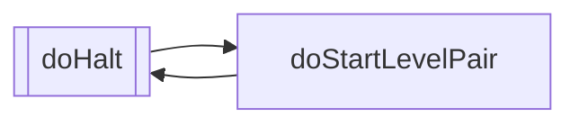
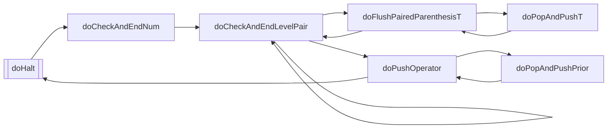
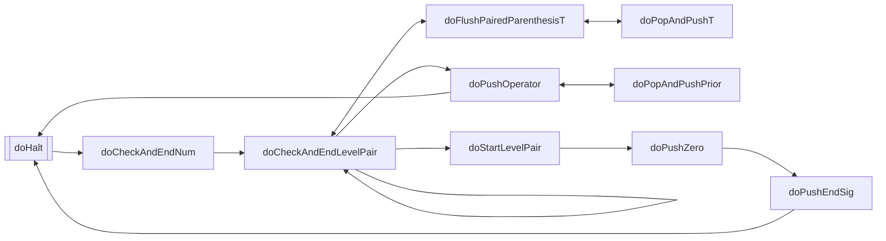
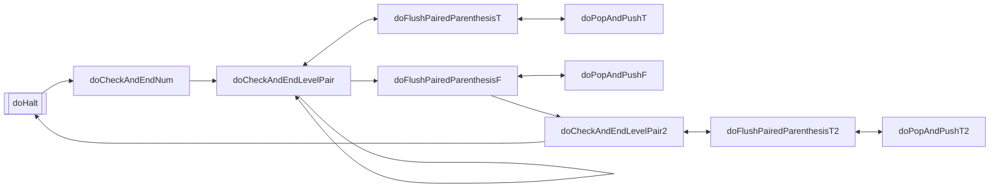
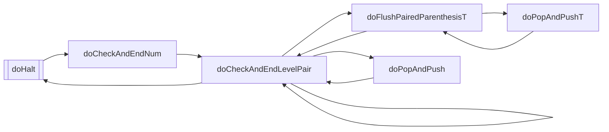
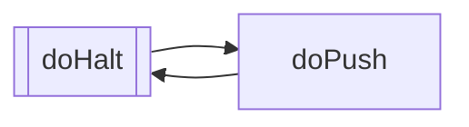

# State diagram of RobustCalculator

## State diagram of `(`

## State diagram of `*`

## State diagram of `+-`

## State diagram of `)`

## State diagram of `=`

## State diagram of `0123456789`

